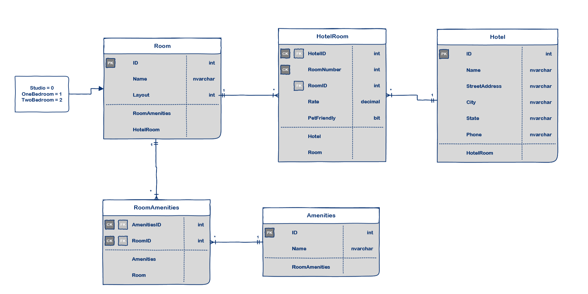

# Async-Inn

## Author
*Paul Rest*

## Description

A full CRUD ASP.NET Core Web App that provides an API for a chain of hotels to keep track of their locations, rooms, and those rooms' amenities.

Employs dependency injection and interfaces to allow for loose coupling between the controllers and the entities being created/read/updated/deleted.

Implements navigation properties and routing with the join table RoomAmenities linking Rooms and Amenities, and the join table (with payload) HotelRooms linking Hotels and Rooms. 

Employs DTO objects to mask the database structure.

Uses ASP.Net Core Identity API to create users and passwords, and then login using those credentials.

Identity: a way to be able to demonstrate who you are to a system. This is frequently done through a username/password combination, a token, two-step verification, and even biometrics.

Employs ASP.Net Core Identity and Authentication to set the level of access required for every CRUD method.

Has xUnit testing for both the AmenityRepository and RoomRepository service files.

---

### Getting Started
Clone this repository to your local machine.

In a command line environment with Git installed:

```
git clone GIT REPO URL HERE
```

### To Run the Program from Visual Studio (2019):
Select ```File``` -> ```Open``` -> ```Project/Solution```

Next navigate to the directory you cloned the repository to.

Double click on the ```Async-Inn``` directory.

Then select and open ```Async-Inn```

Select ```Debug``` -> ```Start Debugging``` to the run the app with the debugger

OR

Select ```Debug``` -> ```Start Without Debugging```

---

### Visuals

#### Entity Relationship Diagram (ERD)

##### Student Produced ERD:
Authors:
- *Michael Refvem*
- *Paul Rest* 
- *Robert Carter*


##### Official Code Fellows ERD:


---

### Change Log

#### 2020-07-29 - 2020-08-02

- Full authentication implemented for all API routes. Testing of Amenities and Room service files (AmenityRepository.cs and RoomRepository.cs) in place.

#### 2020-07-28

- Supports authentication using ASP.Net Core's Identity API.

#### 2020-07-27

- Added full DTO implementation.

#### 2020-07-26

- HotelRooms implementation completed.

#### 2020-07-25

- Most of HotelRooms implementation complete.

#### 2020-07-23

- Attempt at implementing custom routing and navigation properties. Incomplete.

#### 2020-07-22

- Controllers are loosely coupled to their entities through dependency injection and interfaces.

#### 2020-07-07

- ASP.NET Core Web App framework in place, including DB and seed data. Supports full CRUD through an API client like Postman.

#### 2020-07-20

- Added ERD to project (planning database stage) 
- Initial commit