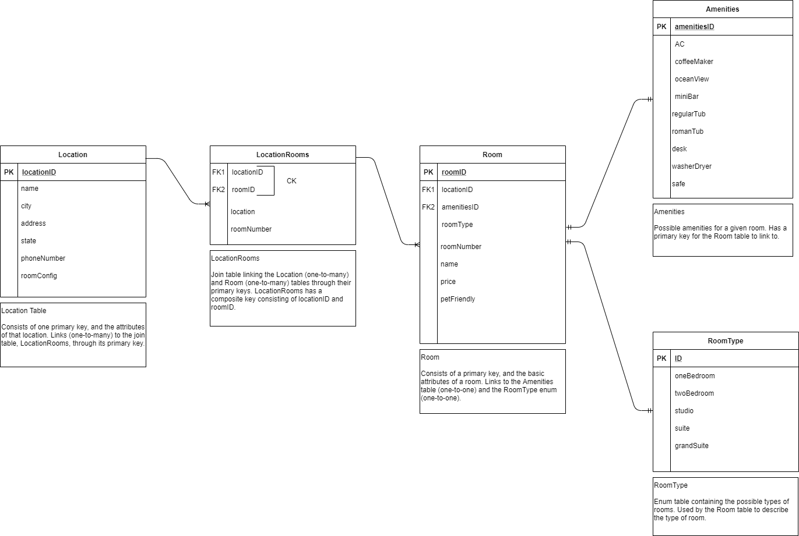

# Async-Inn

## Authors
*Michael Refvem, Paul Rest, Robert Carter*

## Description

The owners of "Async Inn" have approached you with plans to renovate their hotel chain. Currently they are tracking all the different locations and rooms in spreadsheets and binders. They currently have about 10 binders full of paperwork that consists of the difference between each location and the pricing for each room. The amount of time and paperwork it takes to manage the rooms and locations is costing the company both time and money. They are currently looking for a "better way" to maintain their business model.

---

### Getting Started
Clone this repository to your local machine.
```
$ git clone GIT_REPO_LINK
```

---

### Visuals

#### Entity Relationship Diagram (ERD)



---

### Change Log

1.2: *Added ERD to project (planning database stage)* - 20 Jul 2020  
1.1: *Initial commit* - 20 Jul 2020