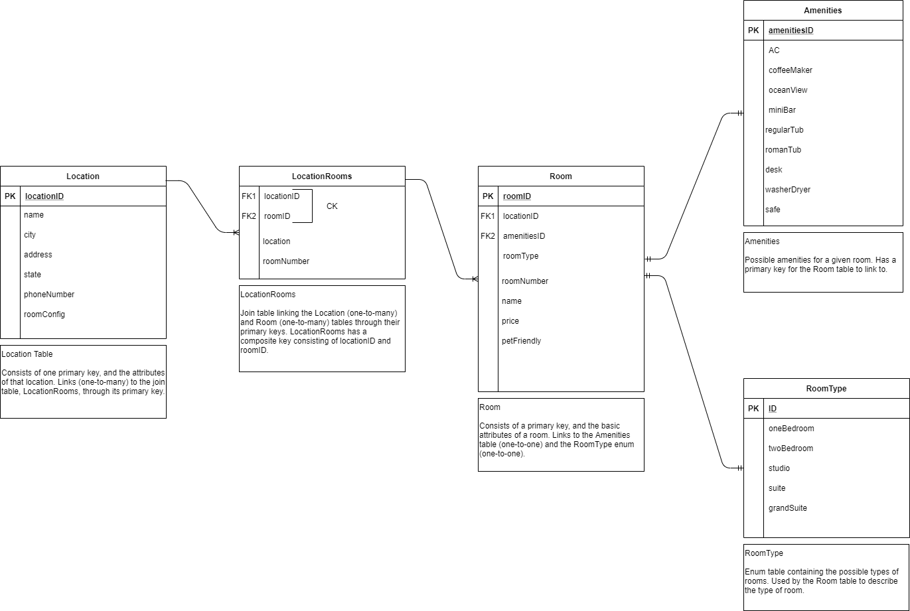

# Async-Inn

## Author
*Paul Rest*

## Description

A full CRUD ASP.NET Core Web App that provides an API for a chain of hotels to keep track of their locations, rooms, and those rooms' amenities.

Employs dependency injection and interfaces to allow for loose coupling between the controllers and the entities being created/read/updated/deleted.

Partially implements navigation properties and routing. In place for Rooms<-->RoomAmenities<-->Amenities. Not yet in place for Hotel<-->HotelRoom<-->Room. Code is presently broken and won't compile (problem files are HotelRoomRepository.cs, lines 33-39, and HotelRoomsController.cs, lines 36-42).

---

### Getting Started
Clone this repository to your local machine.

In a command line environment with Git installed:

```
git clone GIT REPO URL HERE
```

### To Run the Program from Visual Studio (2019):
Select ```File``` -> ```Open``` -> ```Project/Solution```

Next navigate to the directory you cloned the repository to.

Double click on the ```Async-Inn``` directory.

Then select and open ```Async-Inn```

Select ```Debug``` -> ```Start Debugging``` to the run the app with the debugger

OR

Select ```Debug``` -> ```Start Without Debugging```

---

### Visuals

#### Entity Relationship Diagram (ERD)

##### Student Produced ERD:
Authors:
- *Michael Refvem*
- *Paul Rest* 
- *Robert Carter*


##### Official Code Fellows ERD:


---

### Change Log

#### 2020-23-07

- Attempt at implementing custom routing and navigation properties. Incomplete.

#### 2020-22-07

- Controllers are loosely coupled to their entities through dependency injection and interfaces.

#### 2020-21-07

- ASP.NET Core Web App framework in place, including DB and seed data. Supports full CRUD through an API client like Postman.

#### 2020-20-07

- Added ERD to project (planning database stage) 
- Initial commit